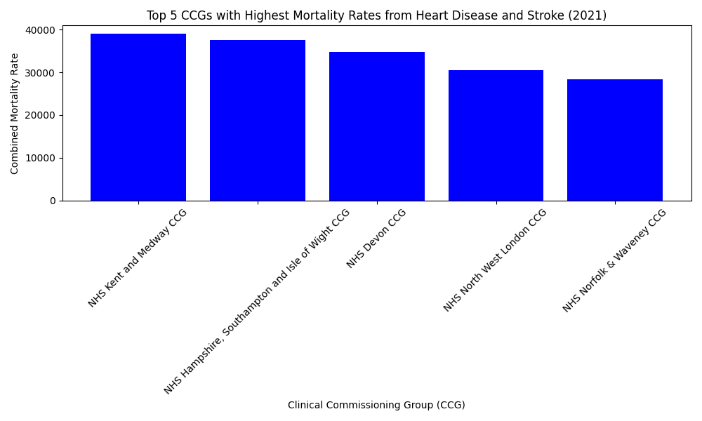

# Cardiovascular Health Data Analysis 

## 📌 Overview
This project analyses cardiovascular health data (Department of Health and Social Care, 2021) to identify the **top 5 Clinical Commissioning Groups (CCGs)** with the highest combined mortality rates from **heart disease and stroke**.

It was developed as part of a technical exercise and demonstrates data cleaning, aggregation, and visualization skills using **Python (pandas, matplotlib)**.

## 📊 Tasks
1. Calculate combined mortality rates for stroke and heart disease across all age groups.  
2. Identify the **top 5 CCGs** with the highest mortality.  
3. Visualize results with a clear, labelled chart.  
4. Briefly describe a method to predict stroke mortalities for 2022.

## 🔎 Results
The 5 CCGs with the highest combined mortality rates were:

1. **NHS Blackpool CCG**  
2. **NHS South Sefton CCG**  
3. **NHS North East Lincolnshire CCG**  
4. **NHS North Cumbria CCG**  
5. **NHS Fylde & Wyre CCG**  

### 📈 Chart


_Source: Department of Health and Social Care, 2021_

## 🧠 Predictive Model Idea
To forecast stroke mortalities for 2022, I would use a **linear regression model** (or Poisson regression, depending on data distribution).  
Key predictive features could include:
- **Population structure** (under vs. over 75 years old).  
- **Prevalence of atrial fibrillation**, a major stroke risk factor.  
- **Blood pressure control rates** (patients <140/90 mmHg).  
- **Historical stroke mortality** trends (2021 data as baseline).  

The model would be trained on the 2021 dataset and validated by comparing predictions with observed 2022 results.  
This would allow healthcare planners to anticipate demand and design targeted interventions.

## ⚙️ How to Run
Clone the repository and run:

```bash
pip install -r requirements.txt
python analysis.py

